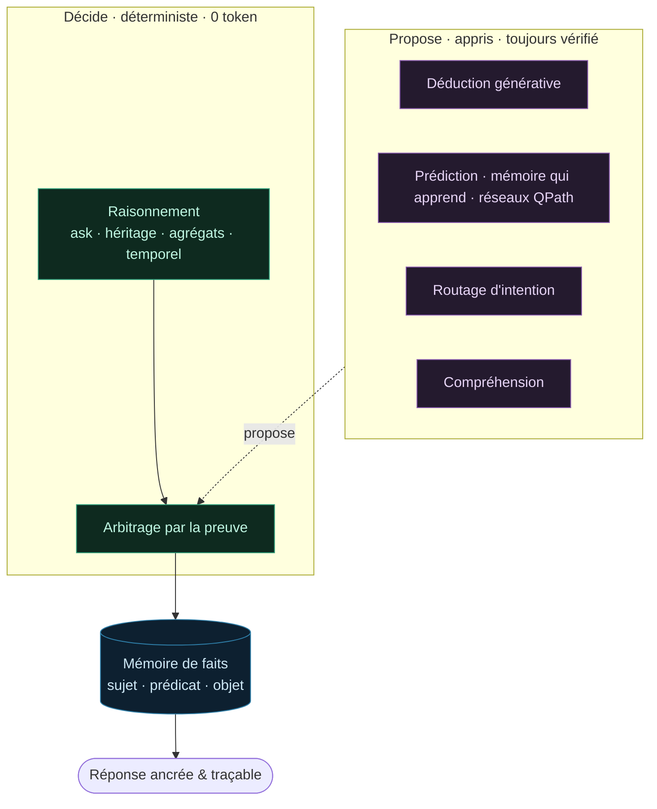

# La couche cognitive

Comment Damba « pense », vue d'ensemble. Damba ne raisonne pas d'un seul bloc : c'est une **pile de
couches** posées autour d'une même **mémoire de faits**, du socle déterministe jusqu'aux briques qui
apprennent. Une règle gouverne l'ensemble :

> **Le déterministe décide, l'appris propose.** Une couche qui apprend reste **conseillère** tant qu'elle
> n'a pas fait ses preuves sur des données retenues. Rien ne change le comportement sans preuve.

## Le socle : une mémoire de faits

Tout repose sur des faits `(sujet, prédicat, objet)` conservés dans la mémoire QPath, avec leur
provenance, leurs drapeaux et leur dimension temporelle. Ce n'est pas une brique parmi d'autres : c'est
le **substrat commun** que toutes les couches lisent et écrivent. Voir [Composants clés](/components) et
[Types de faits](/fact-types).

## Décider : le raisonnement déterministe

La première réflexe de Damba est de répondre **sans modèle de langage** : lecture directe, héritage et
transitivité, agrégats, quantificateurs, questions temporelles. Ces réponses sont **exactes,
reproductibles et gratuites** (0 token). C'est la thèse du produit. Voir [Types de
raisonnement](/reasoning-types) et le [Cycle de vie d'un prompt](/prompt-lifecycle).

## Décider : l'arbitrage par la preuve

Quand plusieurs voies pourraient répondre au même message, Damba tranche **par la preuve** plutôt que par
un ordre figé : chaque voie présente ce qu'elle sait, et un arbitre déterministe retient la revendication
la plus solide. Deux garde-fous : un fait connu l'emporte toujours sur une estimation, et un disjoncteur
de confiance préfère avouer l'incertitude plutôt que servir une réponse peu fiable. Voir
[Faire évoluer le routage](/prompt-lifecycle#faire-evoluer-le-routage-sans-rien-casser).

## Proposer : les briques qui apprennent

Autour du socle vivent des couches qui **proposent**, toujours ramenées à la mémoire de faits et
vérifiées avant d'influer sur une réponse :

- **[Déduction générative](/generative-deduction)** : combler un maillon manquant par déduction ancrée.
- **[Prédiction](/prediction) et [mémoire qui apprend](/nap-grid)** : estimer une valeur ou une classe de
  façon auditable, à partir des faits.
- **[Réseaux QPath](/qpath-ml)** : apprentissage directement sur la représentation de la mémoire.
- **[Routage d'intention](/intent-routing)** : comprendre ce que le message veut faire.
- **[Compréhension](/comprehension)** : coréférence et sens, résolus via la mémoire.

Aucune de ces couches ne décide seule. Elle **propose** ; l'arbitrage et la vérification décident si la
proposition mérite d'être servie.

## Pourquoi cette architecture

> 💡 **Ce qu'elle garantit.** Mettre le déterministe d'abord donne des réponses **vérifiables et
> gratuites** ; garder l'appris en conseiller et tout ramener à des faits **traçables** évite la boîte
> noire. On peut toujours répondre à la question « d'où vient cette réponse ? ».

En pratique, une réponse suit ce trajet : la mémoire et le raisonnement déterministe tentent d'abord, les
couches apprenantes proposent quand le déterministe ne suffit pas, l'arbitrage tranche, et la génération
n'intervient qu'en dernier recours, **ancrée** sur des faits récupérés. Le détail pas à pas est dans le
[Cycle de vie d'un prompt](/prompt-lifecycle).
