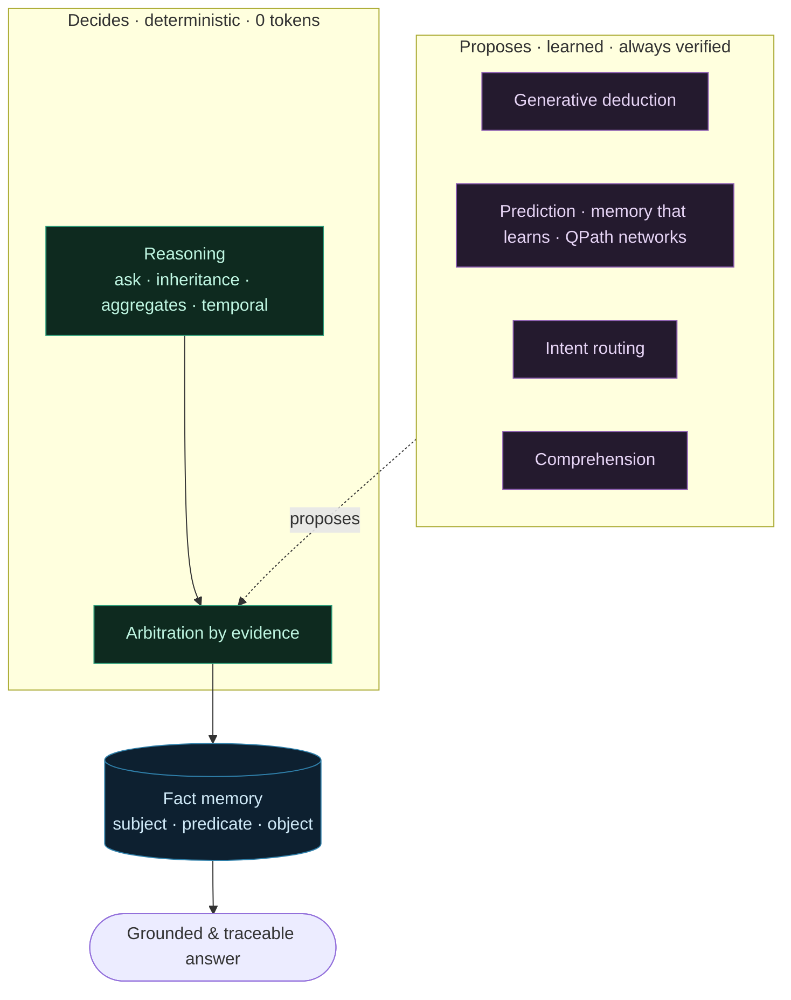

# The cognitive layer

How QPath "thinks", at a glance. QPath does not reason as one block: it is a **stack of layers** built
around a single **fact memory**, from the deterministic foundation up to the parts that learn. One rule
governs the whole:

> **The deterministic decides, the learned proposes.** A learning layer stays an **advisor** until it has
> proven itself on held-out data. Nothing changes behaviour without evidence.

## The foundation: a fact memory

Everything rests on facts `(subject, predicate, object)` held in QPath memory, with their provenance,
flags and temporal dimension. This is not one brick among many: it is the **shared substrate** that every
layer reads and writes. See [Key components](/en/components) and [Fact types](/en/fact-types).

## Deciding: deterministic reasoning

QPath's first reflex is to answer **without a language model**: direct reads, inheritance and
transitivity, aggregates, quantifiers, temporal questions. These answers are **exact, reproducible and
free** (0 tokens). It is the product's thesis. See [Reasoning types](/en/reasoning-types) and the
[Prompt lifecycle](/en/prompt-lifecycle).

## Deciding: arbitration by evidence

When several paths could answer the same message, QPath settles it **by evidence** rather than by a fixed
order: each path presents what it knows, and a deterministic arbiter keeps the strongest claim. Two
safeguards: a known fact always beats an estimate, and a confidence circuit breaker prefers to admit
uncertainty rather than serve an unreliable answer. See
[Evolving the routing](/en/prompt-lifecycle#evolving-the-routing-without-breaking-anything).

## Proposing: the parts that learn

Around the foundation live layers that **propose**, always pulled back to the fact memory and verified
before they can shape an answer:

- **[Generative deduction](/en/generative-deduction)**: fill a missing link by grounded deduction.
- **[Prediction](/en/prediction) and [memory that learns](/en/nap-grid)**: estimate a value or a class
  auditably, from the facts.
- **[QPath networks](/en/qpath-ml)**: learning directly on the memory's representation.
- **[Intent routing](/en/intent-routing)**: understand what the message wants to do.
- **[Comprehension](/en/comprehension)**: coreference and meaning, resolved through the memory.

None of these layers decides on its own. It **proposes**; arbitration and verification decide whether the
proposal is worth serving.

## Why this architecture

> 💡 **What it guarantees.** Putting the deterministic first yields **verifiable, free** answers; keeping
> the learned as an advisor and pulling everything back to **traceable** facts avoids the black box. You
> can always answer "where did this answer come from?".

In practice, an answer follows this path: memory and deterministic reasoning try first, the learning
layers propose when the deterministic falls short, arbitration settles it, and generation only steps in as
a last resort, **grounded** on retrieved facts. The step-by-step detail is in the
[Prompt lifecycle](/en/prompt-lifecycle).
