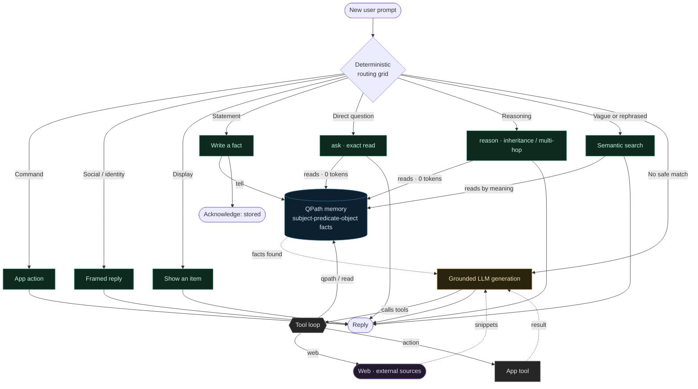

# Prompt lifecycle

What happens, step by step, when a user sends a message? QPath follows one rule: **most deterministic
first, the LLM as a last resort**. We try the paths that read or write the **fact memory** at **0
tokens**; we only call a language model if nothing safer answered, and even then it stays **grounded in
memory**.

The **first matching tier answers and stops**: a command never reaches the LLM, a question never writes,
a statement never goes to generation.



## Reading the graph

- **Green: the 0-token paths.** They read or write the QPath memory directly, with no model call. This
  is the normal route, and by far the most common.
- **Blue: the fact memory** (the QPath graph of triples). Everything converges on it.
- **Amber: LLM generation**, reached only when no safe path answered.
- **The tool loop** (grey) is what the LLM may call to ground itself: `qpath / read` (query **memory**),
  `web` (search **external sources**, in purple), `action` (trigger an **app tool**). Each result returns
  to the model before it writes its answer.

## Step by step

1. **The message arrives** and runs through the **routing grid**, from most deterministic to least.
2. **Command** ("open the vault", "delete my notes"): an action runs, we stop. The LLM is never called.
3. **Social / identity** ("hi", "who are you?"): a framed reply, 0 tokens.
4. **Display** ("show my photos"): we present an item already in memory.
5. **Statement** ("Marie lives in Lyon"): we **write** a fact to memory (`tell`) and acknowledge. A
   statement **never** goes to generation.
6. **Direct question** ("where does Marie live?"): we **read** memory (`ask`) and answer. 0 tokens.
7. **Reasoning** ("is Socrates mortal?"): we follow inheritance chains and multi-hop paths in the graph
   (`reason`). Still a **read** of memory, 0 tokens.
8. **Vague or rephrased question** ("who pleaded guilty?" when the fact is worded differently): search **by
   meaning** in memory (embeddings). Still no generation.
9. **Last resort: the LLM, with its tools.** If nothing answered, we generate, but the model **does not
   invent on its own**: it has a **tool loop** to ground itself. As needed, it **queries memory**
   (`qpath / read`), **searches the web** (`web`, for info absent from memory or fresh), or **triggers an
   app tool** (`action`). It gathers the results, then answers **grounded** on them.

## When exactly the LLM queries memory (and the web)

This is the key point of the last tier. The LLM does not receive the whole memory; it **asks** for what
it needs, and picks the right tool:

```text
User: "Summarise what you know about the Vanier case."
   -> no deterministic tier decides -> LLM
   LLM: <qpath> facts about subject "vanier case" </qpath>
   Memory: returns the relevant triples (0-token read)
   LLM: writes the answer from THOSE facts, inventing nothing.

User: "What is the weather in Paris today?"
   -> not in memory -> LLM
   LLM: <web> weather Paris today </web>
   Web: returns snippets from external sources
   LLM: answers from THOSE snippets (and may store the result).
```

So even the "LLM" path is pulled by **retrieved facts**: generation is for **phrasing**, not **knowing**.
Memory first, web for what is missing or fresh, tools to act.

> 🔎 **Why this order.** Putting exact deduction first yields **verifiable, reproducible, free** answers;
> reserving the LLM for the last tier caps cost and hallucination, since it answers on retrieved facts
> rather than its own memory.
