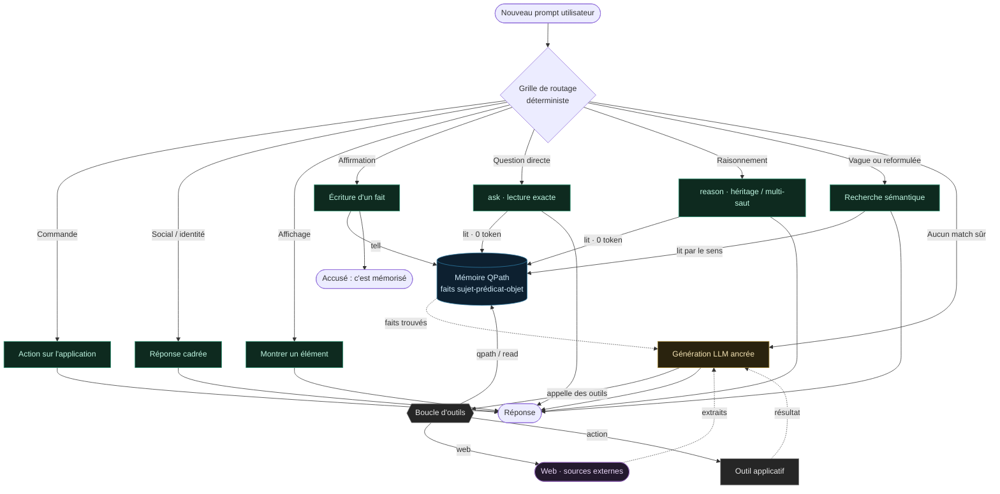

# Cycle de vie d'un prompt

Que se passe-t-il, étape par étape, quand un utilisateur envoie un message ? QPath suit une règle
simple : **le plus déterministe d'abord, le LLM en dernier recours**. On essaie les chemins qui lisent
ou écrivent la **mémoire de faits** à **0 token** ; on n'appelle un modèle de langage que si rien de plus
sûr n'a répondu, et même là, il reste **ancré dans la mémoire**.

Le **premier tier qui correspond répond et s'arrête** : une commande n'atteint jamais le LLM, une
question n'écrit jamais, une affirmation ne part jamais en génération.



## Lecture du graphe

- **En vert : les chemins à 0 token.** Ils lisent ou écrivent directement la mémoire QPath, sans appeler
  de modèle. C'est la voie normale, et de loin la plus fréquente.
- **En bleu : la mémoire de faits** (le graphe QPath de triplets). Tout converge vers elle.
- **En ambre : la génération LLM**, atteinte uniquement quand aucun chemin sûr n'a répondu.
- **La boucle d'outils** (en gris) est ce que le LLM peut appeler pour s'ancrer : `qpath / read`
  (interroger la **mémoire**), `web` (chercher des **sources externes**, en violet), `action` (déclencher
  un **outil applicatif**). Chaque résultat revient au modèle avant qu'il ne rédige.

## Étape par étape

1. **Le message arrive** et passe dans la **grille de routage**, du plus déterministe au moins.
2. **Commande** (« ouvre le coffre », « efface mes notes ») : une action s'exécute, on s'arrête. Le LLM
   n'est jamais sollicité.
3. **Social / identité** (« bonjour », « qui es-tu ? ») : réponse cadrée, 0 token.
4. **Affichage** (« montre mes photos ») : on présente un élément déjà en mémoire.
5. **Affirmation** (« Marie habite à Lyon ») : on **écrit** un fait dans la mémoire (`tell`) et on accuse
   réception. Une affirmation ne part **jamais** en génération.
6. **Question directe** (« où habite Marie ? ») : on **lit** la mémoire (`ask`) et on répond. 0 token.
7. **Raisonnement** (« Socrate est-il mortel ? ») : on suit les chaînes d'héritage et les sauts multiples
   dans le graphe (`reason`). Toujours une **lecture** de la mémoire, 0 token.
8. **Question vague ou reformulée** (« qui a plaidé coupable ? » alors que le fait est tourné autrement) :
   recherche **par le sens** dans la mémoire (embeddings). Toujours sans génération.
9. **Dernier recours : le LLM, avec ses outils.** Si rien n'a répondu, on génère, mais le modèle
   **n'invente pas seul** : il dispose d'une **boucle d'outils** pour s'ancrer. Selon le besoin, il
   **interroge la mémoire** (`qpath / read`), **cherche sur le web** (`web`, pour une info absente de la
   mémoire ou fraîche), ou **déclenche un outil applicatif** (`action`). Il récupère les résultats, puis
   répond **ancré** dessus.

## Quand, exactement, le LLM interroge la mémoire (et le web)

C'est le point clé du dernier tier. Le LLM ne reçoit pas tout le contenu de la mémoire ; il **demande**
ce dont il a besoin, et choisit le bon outil :

```text
Utilisateur : « Résume ce que tu sais sur l'affaire Vanier. »
   -> aucun tier déterministe ne tranche -> LLM
   LLM : <qpath> faits du sujet « affaire vanier » </qpath>
   Mémoire : renvoie les triplets pertinents (0 token de lecture)
   LLM : rédige la réponse à partir de CES faits, sans en inventer.

Utilisateur : « Quelle est la météo à Paris aujourd'hui ? »
   -> absente de la mémoire -> LLM
   LLM : <web> météo Paris aujourd'hui </web>
   Web : renvoie des extraits de sources externes
   LLM : répond à partir de CES extraits (et peut mémoriser le résultat).
```

Ainsi, même le chemin « LLM » reste tiré par des **faits récupérés** : la génération sert à **formuler**,
pas à **connaître**. Mémoire d'abord, web pour ce qui manque ou qui est frais, outils pour agir.

> 🔎 **Pourquoi cet ordre.** Mettre la déduction exacte en premier donne des réponses **vérifiables,
> reproductibles et gratuites** ; réserver le LLM au dernier tier limite le coût et les hallucinations,
> puisqu'il répond sur des faits récupérés plutôt que de mémoire propre.
